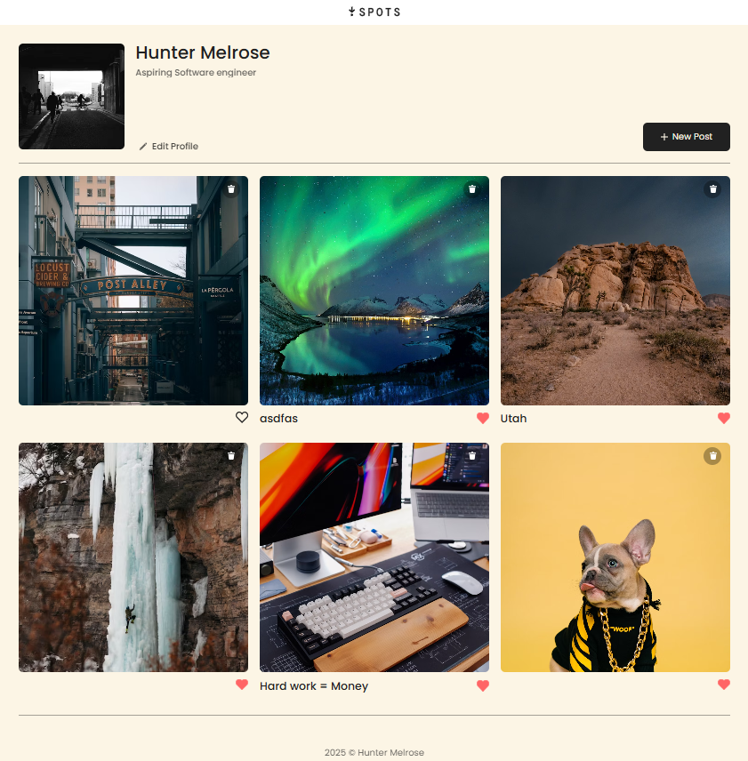

# Spots - Interactive Image Sharing Platform

A responsive web application that allows users to create profiles, share images with descriptions, and curate their favorite content through a like system.




## 🌐 Live Demo
[View Live Site](https://huntermelrose831.github.io/se_project_spots) | [Watch Demo Video](https://drive.google.com/file/d/1Jyu-_D8q_f7_nHr57D64ateDAZhQttGu/view?usp=sharing)

## 🎯 Project Overview

Spots was born from my desire to create a clean, user-friendly image sharing experience that works seamlessly across all devices. As someone passionate about both photography and web development, I wanted to build a platform that prioritizes visual content while maintaining excellent usability.

### Why I Built This
- **Portfolio Demonstration**: Showcase my ability to create responsive, interactive web applications
- **User Experience Focus**: Design an intuitive interface that works beautifully on mobile and desktop
- **Technical Growth**: Challenge myself to implement interactive features using vanilla JavaScript

## ✨ Key Features

- **📱 Fully Responsive Design**: Seamless experience across desktop, tablet, and mobile devices
- **👤 Profile Management**: Users can edit their profiles and personalize their experience
- **🖼️ Image Sharing**: Upload and share images with detailed descriptions
- **❤️ Like System**: Save favorite images for easy access later
- **🎨 Modern UI**: Clean, intuitive interface with smooth interactions

## 🛠️ Technical Implementation

### Technologies Used
- **HTML5**: Semantic markup for accessibility and SEO
- **CSS3**: Modern styling with Flexbox and Grid layouts
- **Responsive Design**: Mobile-first approach with media queries
- **JavaScript**: Interactive functionality and DOM manipulation

### Technical Highlights
- **Mobile-First Design**: Built with mobile users in mind, then enhanced for larger screens
- **CSS Grid & Flexbox**: Efficient layout systems for complex responsive designs
- **Media Queries**: Breakpoints optimized for common device sizes
- **Cross-Browser Compatibility**: Tested across major browsers

## 🎮 How to Use

1. **Visit the Site**: Click the live demo link above
2. **Explore Content**: Browse through shared images and descriptions
3. **Interact**: Like images you want to save for later
4. **Customize**: Edit your profile to personalize your experience
5. **Share**: Add your own images with descriptions

## 🚀 Installation & Setup

```bash
# Clone the repository
git clone https://github.com/huntermelrose831/se_project_spots.git

# Navigate to project directory
cd se_project_spots

# Open in your preferred browser
open index.html
```

## 📱 Responsive Design Approach

This project demonstrates my understanding of modern responsive web design:

- **Breakpoints**: Carefully chosen to accommodate real device usage patterns
- **Flexible Layouts**: Components that adapt gracefully to any screen size
- **Touch-Friendly**: Optimized interactions for mobile users
- **Performance**: Lightweight and fast-loading on all devices

## 🔧 Development Challenges & Solutions

### Challenge 1: Complex Responsive Layouts
**Problem**: Creating layouts that work well on both wide desktop screens and narrow mobile screens
**Solution**: Implemented CSS Grid for the main layout and Flexbox for component-level arrangements, with strategic breakpoints

### Challenge 2: Image Display Optimization
**Problem**: Ensuring images look great across different screen sizes without sacrificing performance
**Solution**: Used responsive image techniques and CSS object-fit for consistent display

### Challenge 3: Interactive Elements on Touch Devices
**Problem**: Like buttons and profile editing needed to work well with both mouse and touch
**Solution**: Implemented touch-friendly sizing and hover states that translate well to mobile

## 📈 What I Learned

- **Responsive Design Mastery**: Gained deep understanding of mobile-first development
- **User Experience Design**: Learned to prioritize user needs in interface design
- **Performance Optimization**: Discovered techniques for fast-loading web applications
- **Cross-Device Testing**: Developed systematic approaches to ensure compatibility

## 🔮 Future Enhancements

- User authentication system
- Image upload functionality
- Comments and social features
- Advanced filtering and search
- Progressive Web App capabilities

## 🤝 Connect With Me

I'm passionate about creating user-centered web experiences and always excited to discuss new opportunities!

- **GitHub**: [@huntermelrose831](https://github.com/huntermelrose831)
- **LinkedIn**: [Your LinkedIn Profile]
- **Email**: [your.email@example.com]

## 📄 License

This project is open source and available under the [MIT License](LICENSE).

---

*Built with ❤️ by Hunter Melrose - Turning ideas into interactive web experiences*
